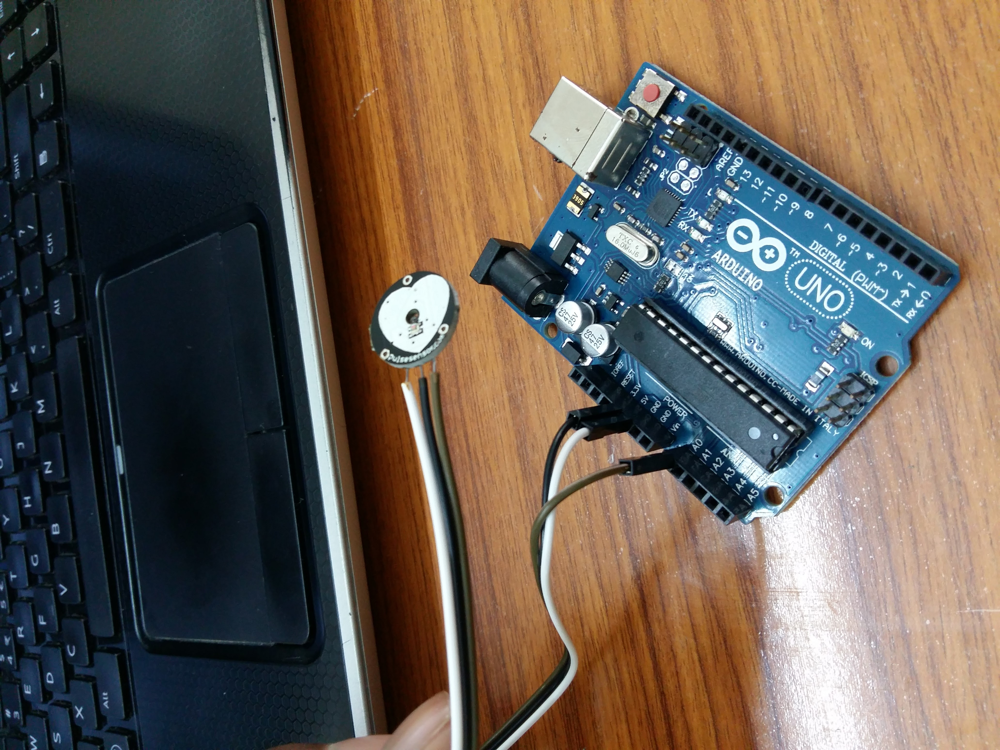
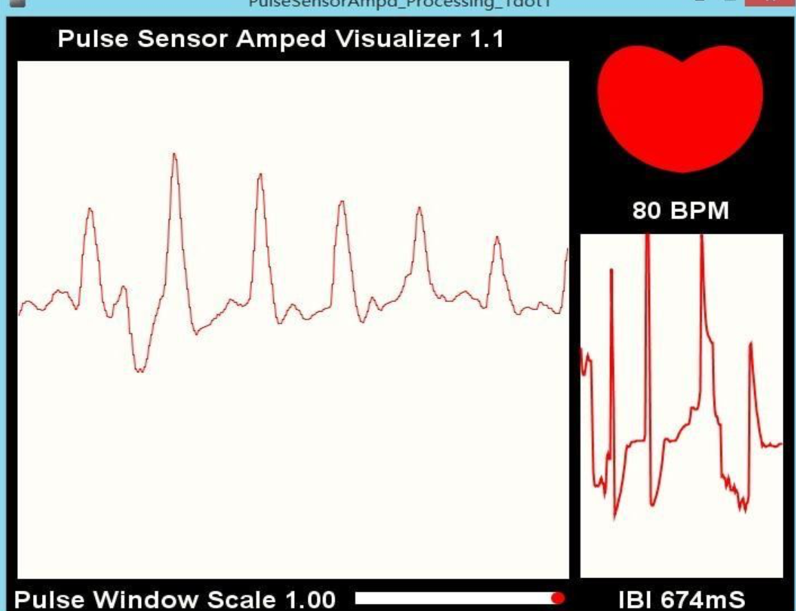

# PHT ( Predective health terminal )
Note:- This is a part of the project and is not the entire project
<b> This is a hand crafted code without using library functions wich aims to finding the pulse rate of a human being.</b>

##Getting Started:-
You will need:-
<ul><li> Arduino board</li>
  <li> pulse rate sensor</li>
  <li> few red and green led</li>
</ul>

###Make connections as below:-
 
 
 
 

#### Understanding:-
 <ul>
  <li> Pulse.io contains code for identifying a pulse based on a certain cutoff which was fixed after analyzing the graph of the signal that we were able to see.
  <li> Few readings might have some errors. We have checkError function which handles this error. (We have done count*4 which indicates that are interval is for 15 seconds).
  <li> Once the red light blinks, which indicates either that there is an error in sensing or that the person has low pulse rate, the person can keep his finger for a recompute of the pulse rate. A consecutive 3 red lights can indicate that the person has a low pulse rate and needs medication.
  <li> If green light glows, it means that the pulse rate is rightly computed
  <li> The collection of such data in certain period can be used to analyze and make predictions(using regression on current data and classifiation on training data) as to whether the person is getting ill or not.
  </ul>
